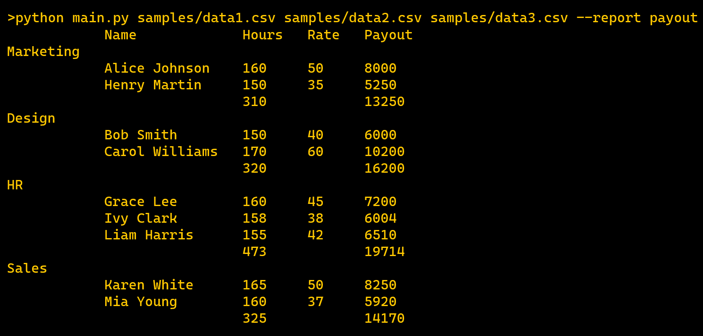
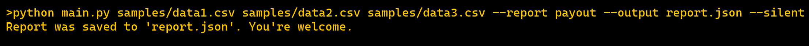

# Report Generator

This project is a command-line tool for generating structured and readable reports from one or more CSV files. It supports multiple output formats, configurable report types, grouping logic, and additional computed fields. The tool is designed to be lightweight, extensible, and developer-friendly.

## Features

- Parses multiple CSV files in a single run
- Groups employee data by department, ID, or other fields
- Calculates totals for fields like hours and payout
- Outputs formatted reports to the terminal, JSON, or plain text files
- Allows silent mode for background or automated use
- Customizable report generation logic via Python subclasses
- Fully tested using `pytest`, but no dependencies are required to run the script

## Installation

No installation is required to use this script — it runs with Python 3.6+ and only uses standard libraries.

To clone and optionally prepare for testing:

```bash
git clone https://github.com/mosphox/reports.git
cd reports
pip install -r requirements.txt  # optional, only needed to run tests
```

## CSV File Format

CSV files must include a header row with the following column names:
```
id,department,email,name,hours_worked,(hourly_rate/rate/salary)
```
Can appear in any order
## Usage

Run the script directly with Python:

```
python reports/main.py FILES... --report REPORT [options]
```

### Required Arguments
```
    FILES: One or more CSV files to process (can be relative or absolute paths)
    -r, --report REPORT: Report type to generate (e.g. payout)
```


### Optional Arguments
```
    -s, --silent: Suppresses output to the console (used for file-only export)
    -o, --output OUTPUT: Path to the output file (automatically adds .txt or .json)
    -f, --format FORMAT: Output format (supported: json, text), default is json
```

## Example Usages

Generate and print a report in the console:

Generate and save a report to a JSON file:


## Sample CSV Files

Three example files are included in the sample/ directory to demonstrate functionality:

## Running Tests (Optional)

Tests are written using pytest. To run them:
```
pip install pytest
```
or
```
pip install -r requirements.txt
```
then
```
pytest reports
```
Note: pytest is only required for development. Running the report generator script does not require any external dependencies.
